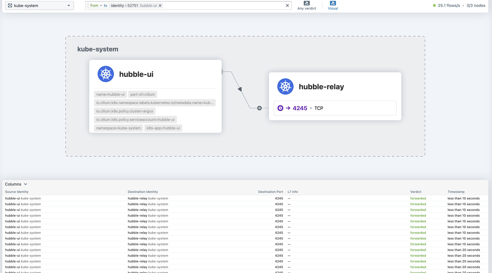
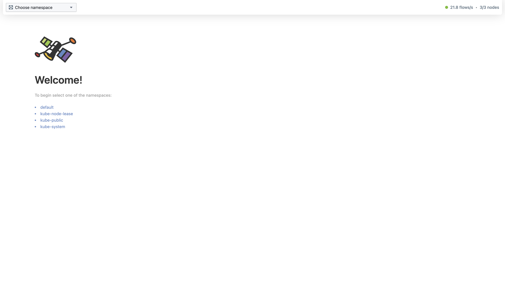
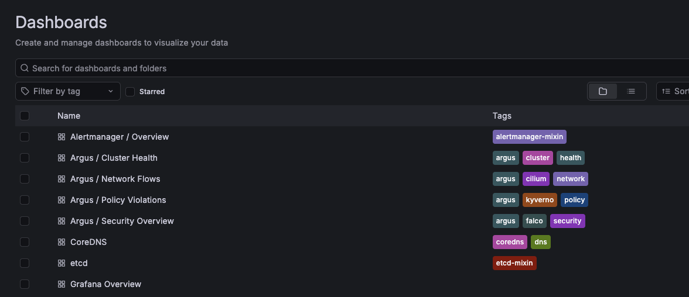
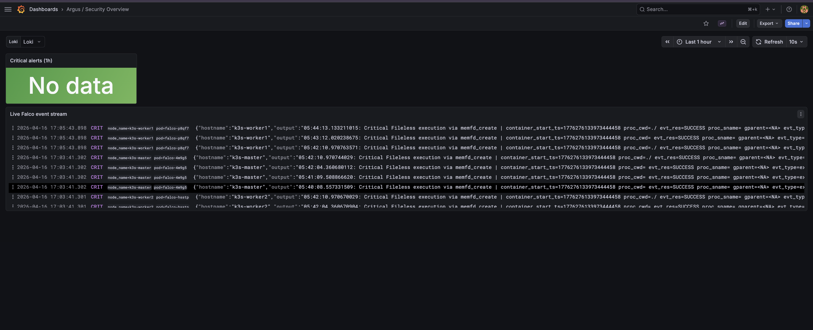
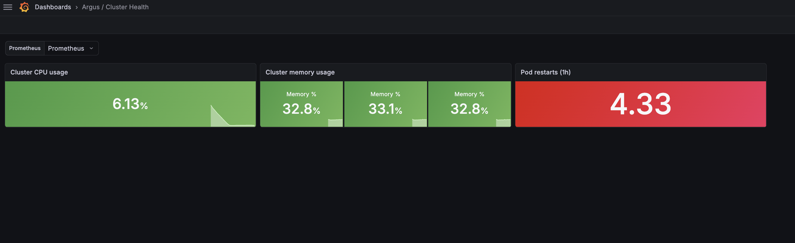
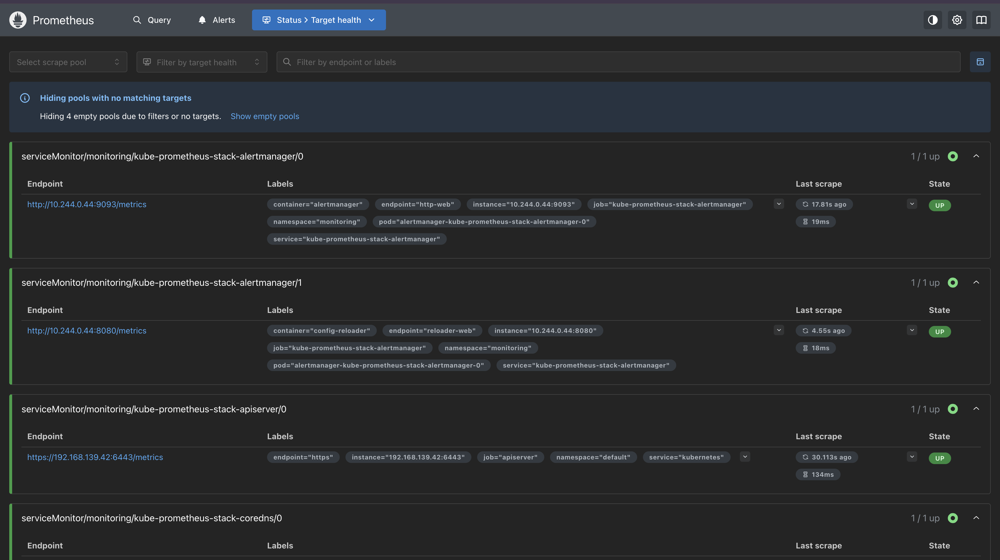
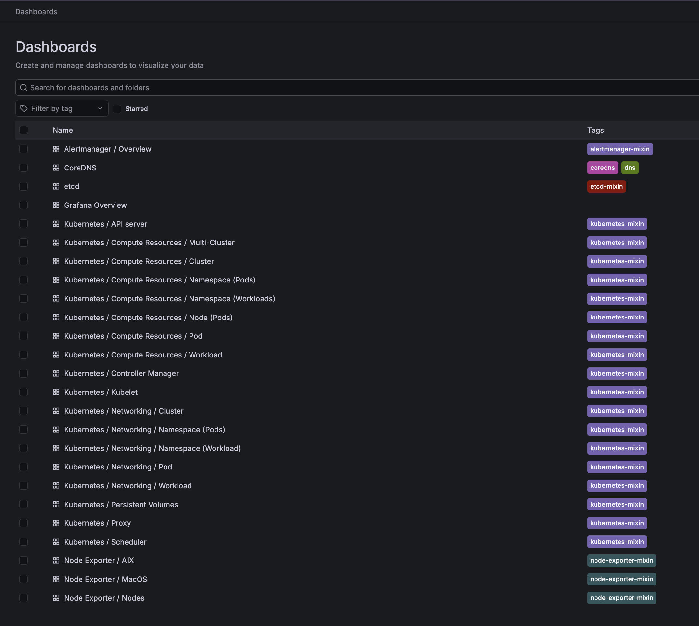
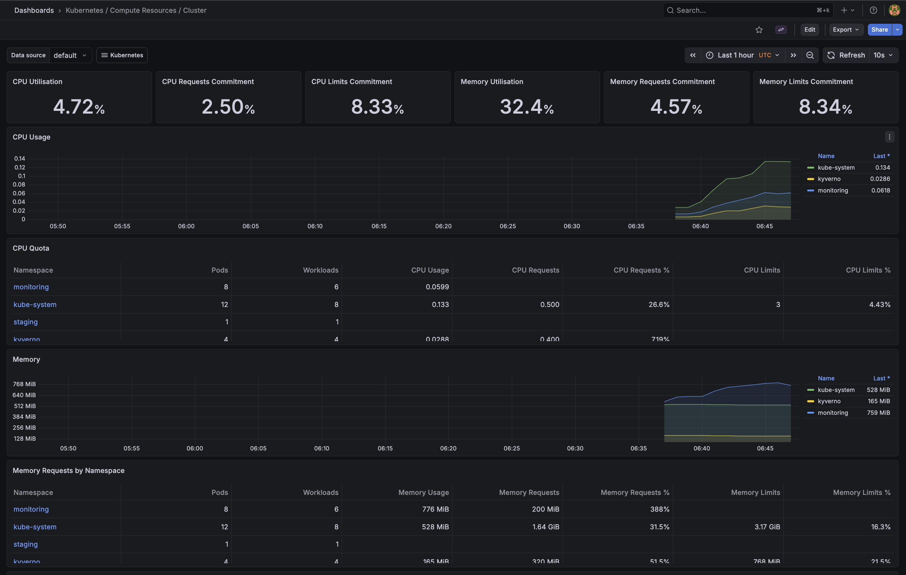
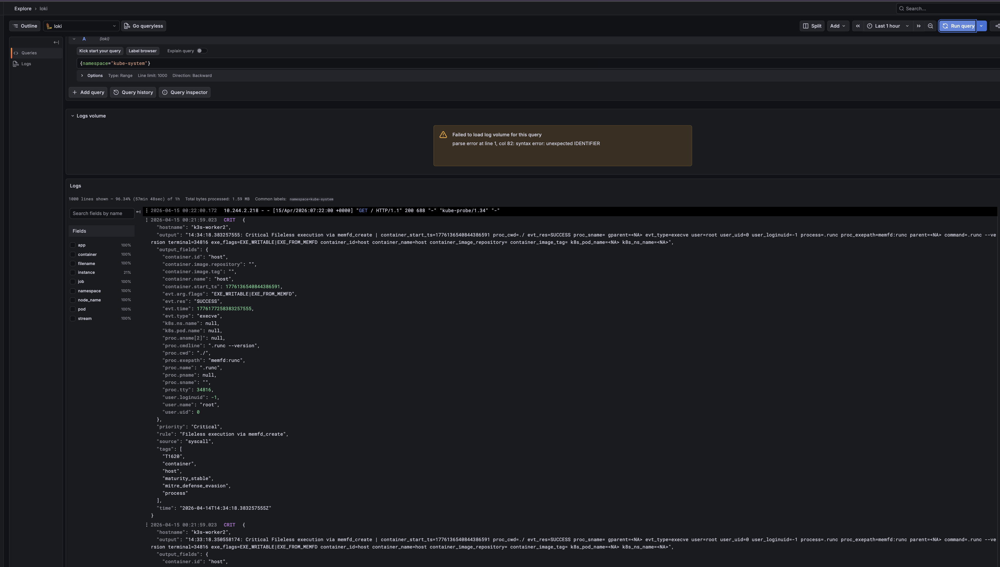

<!--
Argus — Autonomous Kubernetes Security Platform
Copyright (c) 2026 Kaushikkumaran
Original work — see NOTICE for details
Commit history: https://github.com/CodeBuildder/argus-k8s/commits/main
-->

# Argus

Argus is a security platform for Kubernetes clusters. It watches for threats in real time, enforces policies before anything suspicious can run, and uses an AI agent to reason about incidents and take action automatically.

Kubernetes is the industry-standard system for running containerised applications at scale. Argus adds a security layer on top: continuous monitoring at the operating system level, admission control that blocks unsafe workloads before they start, and an AI layer that interprets alerts and decides what to do.

## Cluster status

### Network visibility


*Every network connection between services, captured in real time at the kernel level*

| Node | Role | IP | Status |
|---|---|---|---|
| k3s-master | Control plane | 192.168.139.42 | Ready |
| k3s-worker1 | Worker | 192.168.139.77 | Ready |
| k3s-worker2 | Worker | 192.168.139.45 | Ready |

**Cilium:** v1.15.0, eBPF mode, kube-proxy replacement enabled
**Hubble:** Relay + UI enabled, live network flow observability active

Cilium is the networking layer that connects containers and enforces which services are allowed to talk to each other. Hubble sits on top and gives a live view of every network connection across the cluster.

eBPF (Extended Berkeley Packet Filter) is a Linux kernel technology that lets you observe and control what programs do at the lowest level of the operating system, without modifying the kernel itself. It is how Cilium and Falco get their deep visibility.

### Hubble UI: 3/3 nodes, 20.6 flows/s



## Security status

### Falco: Runtime threat detection

Falco watches every system call made by every process running inside the cluster. A system call is how a program asks the operating system to do something: open a file, start a new process, make a network connection. Falco knows which calls are normal for each workload and alerts immediately when something unexpected happens.

- **Driver:** modern_ebpf (runs without needing kernel patches or special headers)
- **Status:** Running on all 3 nodes
- **Output:** Structured JSON alerts sent via HTTP to the Argus agent
- **Test:** Running `cat /etc/shadow` inside a container was detected in under 1ms and tagged with MITRE ATT&CK technique T1555 (credential access)
- **Custom rules:** shell spawned in production, unexpected outbound connections, writes to sensitive paths, use of curl/wget, privilege escalation attempts

MITRE ATT&CK is a publicly maintained catalogue of attacker tactics and techniques. Falco tags each alert with the relevant technique so the AI agent has context on what kind of attack may be in progress.

**Why Falco:** Most security tools sit at the application layer and only see what the app itself reports. Falco sits below the application and below the container runtime, so it catches things that never appear in application logs: a shell spawned inside a running container, a file read on a sensitive path, an outbound connection from a service that should never make one. The structured JSON output feeds directly into the Argus agent with threat context already attached.

### Kyverno: Admission control

Kyverno is a policy engine that acts as a gatekeeper at the point of deployment. Every time a workload is submitted to the cluster, Kyverno checks it against a set of rules before it is allowed to run. If the workload does not meet the requirements, it is rejected before a single container starts.

- **Status:** Running (v1.17.1)
- **Mode:** Enforce (non-compliant workloads are blocked outright, not just flagged)
- **Policies active:**
  - `disallow-root-containers`: rejects any pod that would run as the root user inside the container
  - `require-resource-limits`: rejects pods that do not declare CPU and memory limits, preventing a single workload from starving the cluster
  - `approved-registries-only`: rejects images pulled from outside approved container registries, blocking untrusted code from running

### Cilium Network Policies: Zero-trust network segmentation

Zero-trust means nothing is allowed to communicate by default. Every connection must be explicitly permitted by a policy. If a workload is compromised, it cannot reach other services unless a rule specifically allows it.

- **Status:** Applied
- **Model:** Default deny on all incoming traffic, explicit allow rules only
- **Rules:**
  - Production and staging namespaces: no incoming connections allowed by default
  - Monitoring namespace: allowed to scrape metrics from production and staging
  - Argus system namespace: allowed to reach production and staging to take remediation actions
  - Any cross-namespace traffic not listed above is blocked and logged as a dropped flow in Hubble

## Observability status

Observability means having enough visibility into a running system to understand what it is doing and why. The stack here covers three signals: metrics (numbers over time), logs (text events), and network flows (who is talking to whom).

### Prometheus: Metrics collection

Prometheus is the industry-standard tool for collecting and storing time-series metrics from Kubernetes. It scrapes data from every component in the cluster on a regular interval and stores it for querying and alerting.

- **Status:** Running (kube-prometheus-stack)
- **Retention:** 7 days
- **Targets being scraped:** alertmanager, API server, CoreDNS, node-exporter on all 3 nodes, kube-state-metrics, kubelet

### Grafana: Dashboards

Grafana turns the raw metrics and logs collected by Prometheus and Loki into readable dashboards and charts.

- **Status:** Running
- **Access:** `kubectl port-forward -n monitoring svc/kube-prometheus-stack-grafana 3000:80`
- **Login:** admin / argus-admin
- **Dashboards:** 25 default Kubernetes dashboards loaded

### Loki: Log aggregation

Loki collects and stores logs from every pod running in the cluster. Promtail is the agent that runs on each node and ships those logs to Loki. Logs can then be queried and visualised in Grafana alongside the metrics.

- **Status:** Running (loki-stack)
- **Retention:** 72 hours (constrained by the 20GiB disk on each VM)
- **Promtail:** Running on all 3 nodes, collecting logs from every pod
- **Falco pipeline:** Falco's JSON alerts are parsed and tagged with labels (rule name, priority, hostname) before being stored, making them filterable in Grafana
- **Query:** `{app="falco"}` in Grafana Explore returns all Falco alerts as structured log entries
- **Datasource endpoint:** http://loki.monitoring.svc.cluster.local:3100

### Custom dashboards: Argus security views

Four purpose-built dashboards covering the security signals specific to Argus.

- **Argus / Security Overview:** live Falco event stream, count of critical alerts in the last hour
- **Argus / Cluster Health:** node CPU and memory usage, pod restart count
- **Argus / Policy Violations:** stream of Kyverno admission denials showing what was blocked and why
- **Argus / Network Flows:** Cilium dropped flow count, forwarded vs dropped traffic over time
- **Provisioning:** ConfigMap with grafana_dashboard=1 label, picked up automatically by Grafana and survives pod restarts

### Screenshots








*Critical Falco detections (T1620 fileless execution) ingested and queryable via LogQL*

## Stack

| Layer | Tool | What it does |
|---|---|---|
| Local cluster | k3s on OrbStack VMs | Lightweight Kubernetes, runs natively on Apple Silicon |
| Networking | Cilium + Hubble | eBPF-based container networking with live traffic visibility |
| Runtime security | Falco | Watches system calls on every node and alerts on suspicious activity |
| Admission control | Kyverno | Blocks non-compliant workloads at deploy time before they can run |
| Service encryption | Linkerd | Automatically encrypts all traffic between services (mTLS) |
| Metrics | Prometheus | Scrapes and stores time-series metrics from the whole cluster |
| Logs | Loki + Promtail | Collects and stores logs from every pod, queryable in Grafana |
| Dashboards | Grafana | Unified view across metrics, logs, and security events |
| AI Agent | Python + Claude API | Reads Falco alerts, pulls cluster context, reasons about severity, routes a response |
| UI | React + Tailwind | Real-time incident feed, human approval queue, agent chat |

## Author

Built by [Kaushikkumaran](https://github.com/CodeBuildder), April 2026

Original architecture, AI agent design, and UI concept.
All design decisions documented in [docs/decisions/](docs/decisions/).

## Modules

| Module | Description | Status |
|---|---|---|
| 1: Cluster Foundation | OrbStack VMs, k3s, Cilium, Hubble | Complete |
| 2: Security Layers | Falco, Kyverno, CiliumNetworkPolicy | Complete |
| 3: Observability Stack | Prometheus, Grafana, Loki | Complete |
| 4: AI Agent Engine | Falco webhook, context enrichment, Claude reasoning, action router | Pending |
| 5: Command and Control UI | React dashboard, approval queue, agent chat | Pending |

## How it works

[fill in after agent is built]

## Local setup

### Prerequisites
- macOS (Apple Silicon M-series)
- OrbStack installed (`brew install orbstack`)
- CLI tools: `brew install kubectl helm k3sup cilium-cli hubble k9s`

### Spin up the cluster
```bash
make cluster-up
```

This provisions 3 OrbStack VMs, installs k3s, deploys Cilium with eBPF kube-proxy replacement, enables Hubble, and creates all namespaces.

### Verify
```bash
make cluster-status
cilium hubble ui
```

## Architecture decisions

See [docs/decisions/](docs/decisions/) for rationale behind every tool choice.
