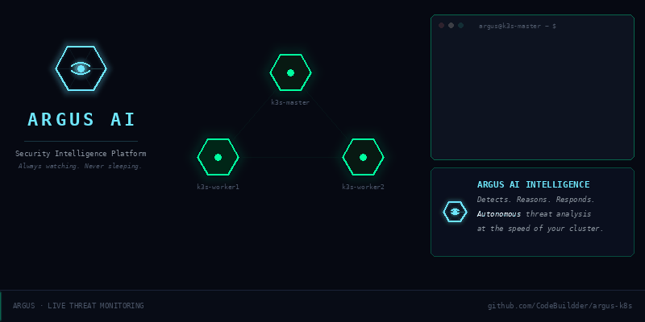
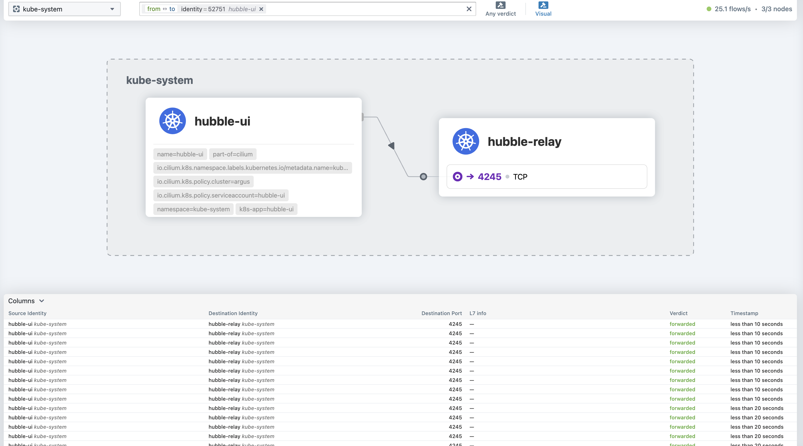
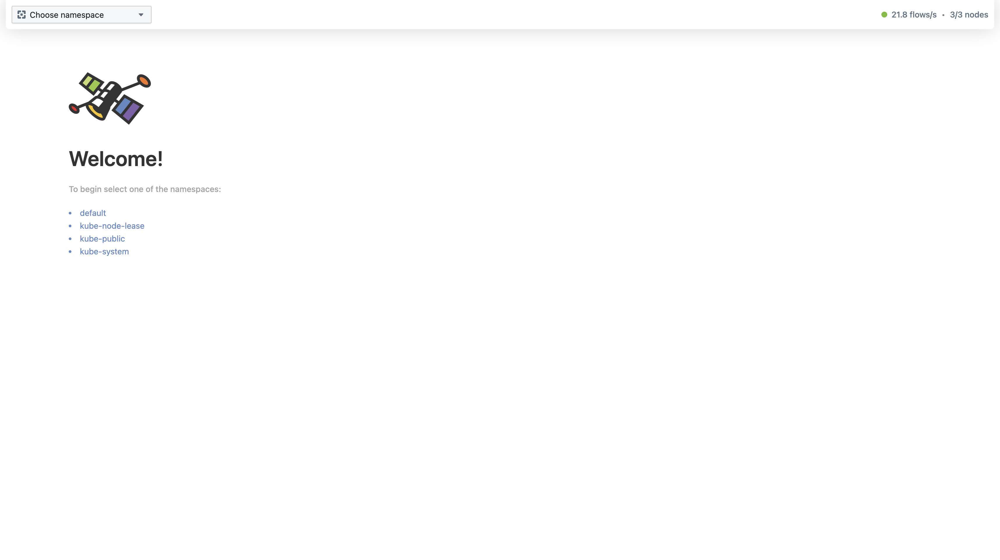
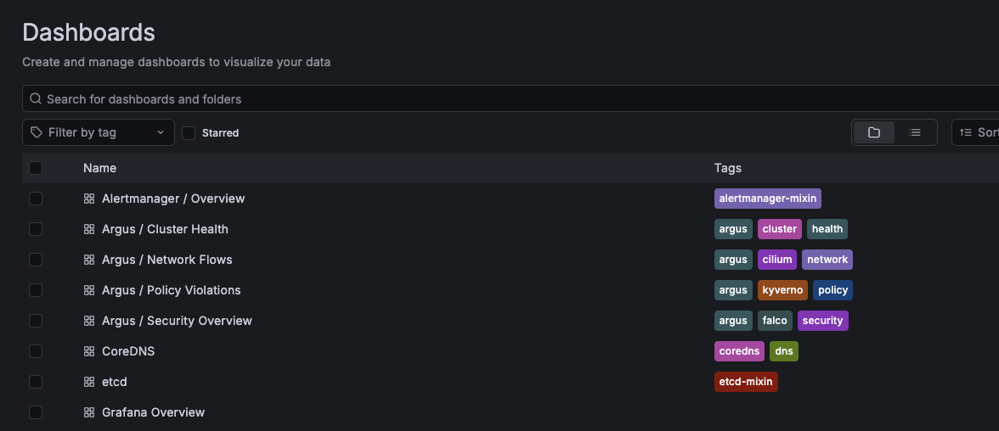
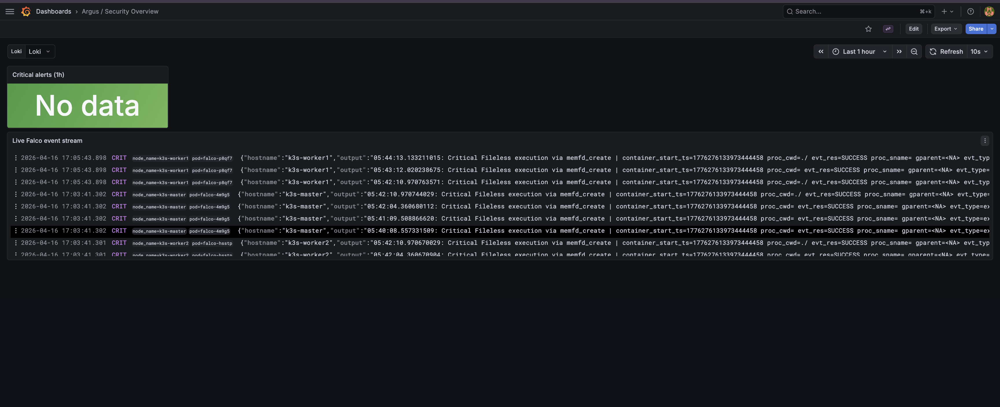
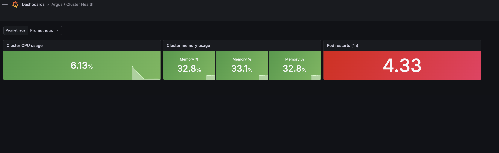
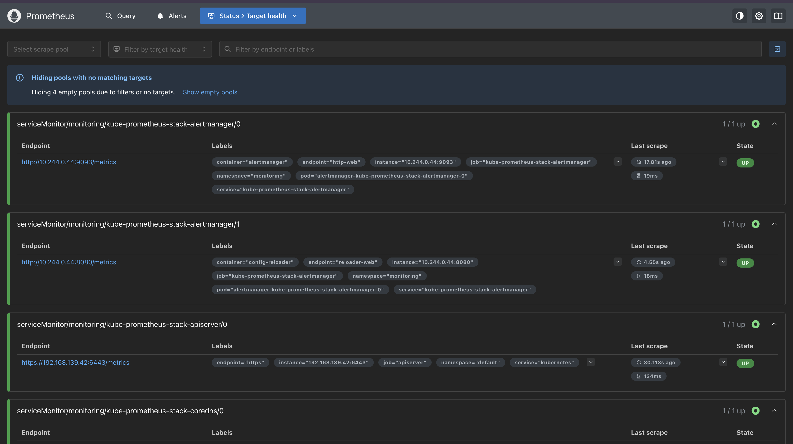
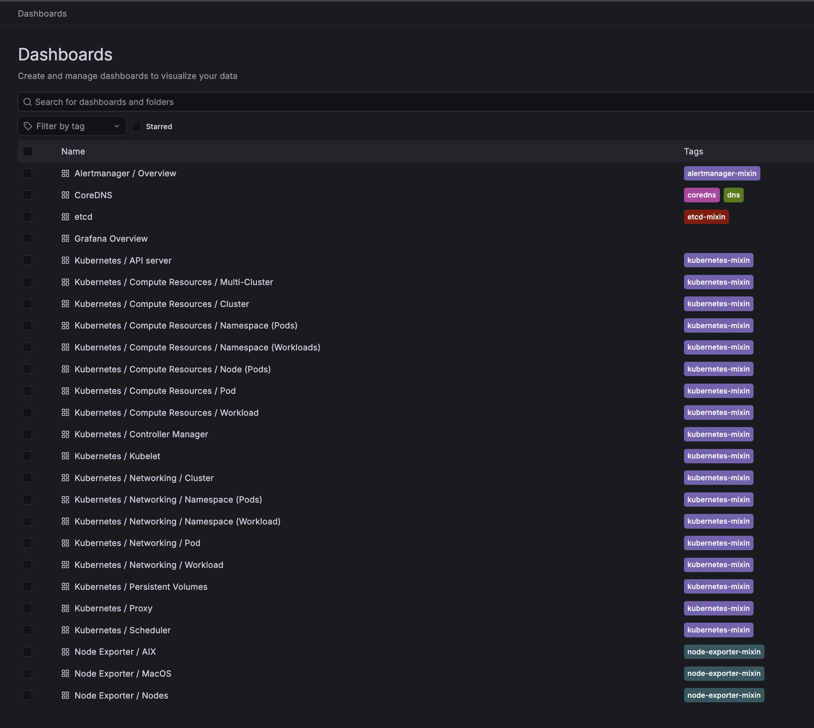
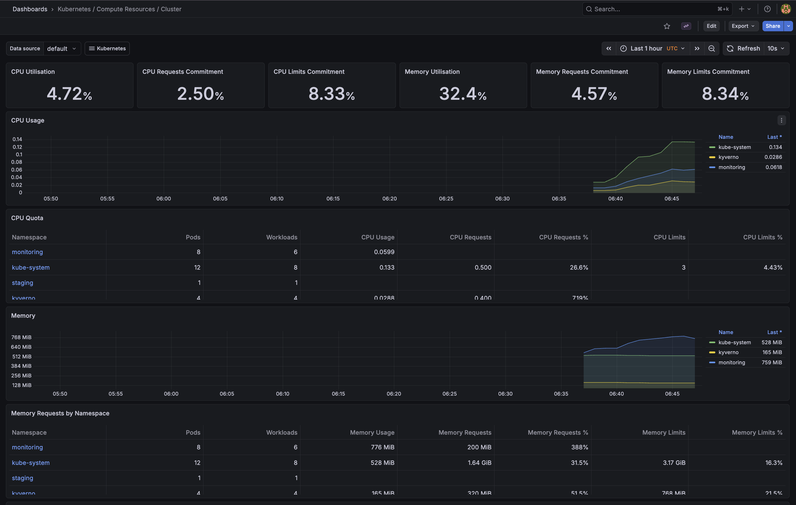
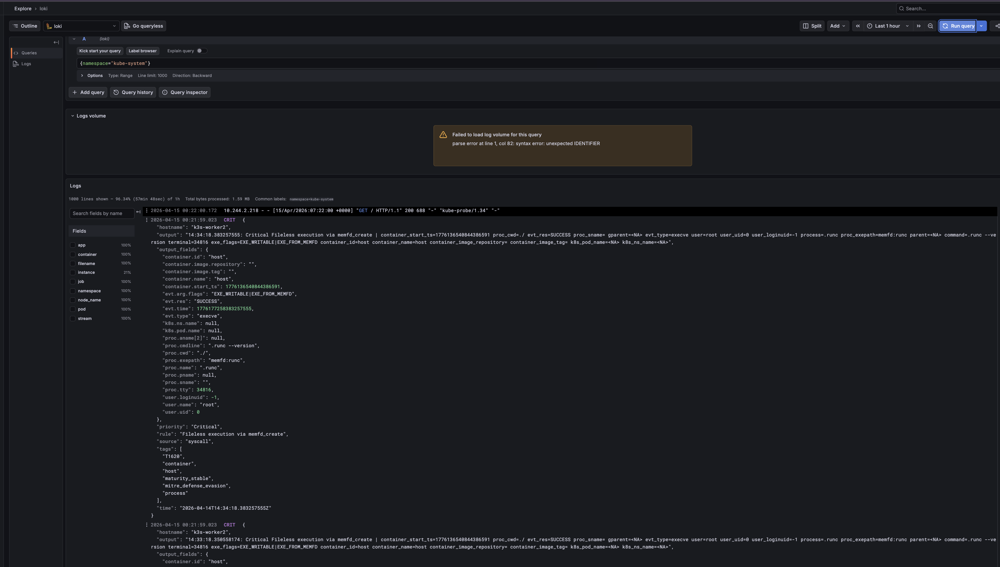

<!--
Argus — Kubernetes Security Platform
Copyright (c) 2026 Kaushikkumaran
Original work — see NOTICE for details
Commit history: https://github.com/CodeBuildder/argus-k8s/commits/main
-->

<p align="center">
  <a href="https://drive.google.com/file/d/1oRYc60bNGRirMWPJlLNnzc_XiEa1ogjE/view?usp=sharing" target="_blank" rel="noopener noreferrer">
    
  </a>
</p>

<h1 align="center">Argus</h1>

<p align="center">
  An OpenAI-native Kubernetes security platform combining eBPF threat detection,
  policy enforcement, and autonomous reasoning for real-time threat response.
</p>

<p align="center">
  <strong>Powered by the OpenAI Responses API and GPT-5.6</strong>
</p>

<p align="center">
  Argus is the security agent in the broader <strong>Sentinel multi-agent platform</strong>,
  alongside Phoenix for resilience and Sentinel for fleet-wide orchestration.
</p>

<p align="center">
  
</p>

<p align="center">
  <a href="https://drive.google.com/file/d/1oRYc60bNGRirMWPJlLNnzc_XiEa1ogjE/view?usp=sharing" target="_blank" rel="noopener noreferrer"><strong>Watch Demo Video</strong></a>
  ·
  <a href="docs/architecture.md"><strong>Architecture</strong></a>
  ·
  <a href="docs/ROADMAP.md"><strong>Roadmap</strong></a>
</p>

<p align="center">
  <a href="https://drive.google.com/file/d/1oRYc60bNGRirMWPJlLNnzc_XiEa1ogjE/view?usp=sharing" target="_blank" rel="noopener noreferrer">
    Click to watch the full demo video
  </a>
</p>

## Start here

Choose one path. The first two focus on Argus; the platform path launches the complete
cross-agent judge experience.

| Path | Use it when | Command |
|---|---|---|
| **Local synthetic** | You want the fastest judge/reviewer experience and do not have Kubernetes | `make demo-local` |
| **Live k3s** | You have the three-node Argus cluster and want real Falco, Cilium, and Kyverno evidence | `make demo-cluster-dry-run`, then `make demo-cluster` |
| **Full platform, cluster-free** | Recommended judge path: all three products, realistic synthetic topology, no Kubernetes | `make demo-platform-dry-run`, then `make demo-platform` |
| **Full platform, live k3s** | Maintainer/video path: observed evidence, approved live chaos, measured recovery | `make doctor-live`, then `make demo-platform-live` |

### Path A — local synthetic, no cluster required

The fastest path to a populated Argus console requires only Python, Node.js, npm, and
curl. It does **not** require OrbStack, Kubernetes, Falco, Cilium, an API key, or cloud
infrastructure.

```bash
make demo-local
```

Then open **http://127.0.0.1:5173**.

`make demo-local` installs missing dependencies, starts the backend and UI, waits for
the backend health check, and generates ten randomized incidents. Synthetic workflows
run without an API key; live reasoning, summaries, threat hunting, forecasts, and chat
use `OPENAI_API_KEY`. Press `Ctrl-C` to stop both services. For every
command, expected result, testing mode, and troubleshooting path, follow the
**[Getting Started guide](docs/GETTING_STARTED.md)**.

### Path B — live three-node k3s

This path requires the existing `argus` kubeconfig context with Cilium, Falco,
Kyverno, and the Argus agent installed. Confirm it without changing the cluster:

```bash
kubectl config use-context argus
make demo-cluster-dry-run
```

If preflight passes, start the bounded live demo:

```bash
make demo-cluster
```

The command displays the active context and requires you to type it exactly before
creating anything. It uses a dedicated `argus-demo` namespace, starts the console,
collects real runtime evidence, and deletes only that namespace on exit.

### Existing OrbStack cluster versus built-in Kubernetes

OrbStack exposes its own single-node Kubernetes context named `orbstack`. That is
**not** the Argus cluster. Argus runs on three Ubuntu VMs managed by OrbStack and uses
the kubeconfig context named `argus`.

```text
OrbStack application
├── built-in Kubernetes → context: orbstack → node: orbstack
└── Linux machines
    ├── k3s-master  ┐
    ├── k3s-worker1 ├→ context: argus → real three-node k3s cluster
    └── k3s-worker2 ┘
```

If those three machines already exist, do **not** run `make cluster-up` again. Select
and verify the existing cluster:

```bash
orb list
kubectl config get-contexts
kubectl config use-context argus
kubectl get nodes -o wide
make demo-cluster-dry-run
make demo-cluster
```

Expected preflight components are three ready k3s nodes plus Cilium, Falco, Kyverno,
and the OpenAI-powered Argus agent. The agent deployment must receive `OPENAI_API_KEY`,
and the OpenAI project must have API quota. At the confirmation prompt, type the exact
context printed by the command (`argus` for this repository's OrbStack cluster).

`make demo-cluster` starts a supervised service port-forward and the React console,
injects the real workloads, prints terminal evidence, and keeps the console available
at **http://127.0.0.1:5173** until `Ctrl-C`. Cleanup stops both local processes and
deletes only the namespace created by that run.

### Path C — full cluster-free platform demo (recommended)

Use this path for the complete judge story. It requires sibling Phoenix, Sentinel, and
Sentinel Platform checkouts plus Docker or OrbStack for one disposable Redis container.
It does **not** require Kubernetes, kubectl, k3s, Cilium, Falco, or Chaos Mesh.

```text
Projects/
├── argus-k8s/                 # run the command here
└── sentinel-stack/
    ├── phoenix/
    ├── sentinel/
    └── sentinel-platform/
```

Install each repository's local dependencies once:

```bash
make setup-local
make -C ../sentinel-stack/sentinel setup-local
npm --prefix ../sentinel-stack/phoenix/dashboard install
```

Run the non-mutating preflight:

```bash
make doctor
```

Then launch the complete experience:

```bash
make demo-platform
```

The command installs missing local dependencies, starts a disposable Redis-backed real
SOG and the real local Argus, Phoenix, and Sentinel services, then seeds a three-node,
multi-namespace service graph. It populates Argus with twelve threats, Phoenix with a
synthetic dependency graph, and Sentinel with multiple correlated lifecycles. A bounded
feed adds a new replay/simulator lifecycle every 20 seconds so refresh timestamps,
counters, timelines, and risk views visibly move during the demo.

Every successful run prints a judge-readable PASS scorecard and writes the exact proof
to `artifacts/demo-platform/latest-demo.json` and
`artifacts/demo-platform/latest-demo.md`. The report includes evidence-publication and
correlation timings, recovery status, approval policy, OpenAI availability, sources,
seed, and provenance. It deliberately reports availability as **not measured** for this
deterministic path instead of turning a simulator recovery into a false production-SLA
claim.

| Console | URL | What to show |
|---|---|---|
| Argus | **http://127.0.0.1:5173** | Security evidence and response |
| Phoenix | **http://127.0.0.1:5174** | Resilience outcome and recovery |
| Sentinel | **http://127.0.0.1:5175** | Unified correlated incident and fleet decision |

Sentinel opens with a read-only **Presentation Preflight** panel. It verifies Argus,
Phoenix, Sentinel, SOG, and OpenAI; Kubernetes-only checks are visibly N/A in portable
mode. The demo refuses to report PASS until every required presentation check is ready.

Every synthetic entity has `demo-data=synthetic`; evidence is explicitly labeled
`replayed` or `simulator`. The local demo never claims live Falco detection, live chaos,
or measured production availability. On `Ctrl-C`, it stops its local processes and
removes its disposable Redis container. It replaces only known project listeners and
kubectl port-forwards on reserved demo ports; unrelated listeners cause a safe failure.
The Sentinel incident drawer uses the same seven-stage resilience timeline as the live
proof, while labeling every portable stage as replayed or simulated and leaving
availability explicitly unmeasured.

### Path D — live k3s-backed platform proof

Run the guarded real-cluster proof separately:

```bash
kubectl config use-context argus
make doctor-live
make demo-platform-live
```

The dry-run is read-only. The real command verifies Cilium, Falco, Kyverno, Argus,
Phoenix, Chaos Mesh, and the SOG; asks for the exact Kubernetes context and the phrase
`INJECT LIVE FAULT`; creates only `sentinel-live-demo`; and launches a two-replica HTTP
service. Argus must observe a bounded Falco-triggering workload before Phoenix creates a
real Chaos Mesh `PodChaos` against one disposable replica. The proof passes only after a
new replacement pod is Ready, both replicas are Ready, continuous HTTP availability is
measured, and Sentinel exposes the correlated Argus + Phoenix incident. `Ctrl-C` stops
the consoles and deletes only the isolated demo namespace. Evidence is written to
`artifacts/demo-platform/latest-live-demo.{json,md}`.
The same readiness result is visible inside Sentinel with live Kubernetes, Cilium,
Falco, Kyverno, and Chaos Mesh evidence and remediation for any failed component.

## Part of the Sentinel multi-agent platform

Argus is the security domain agent in a larger autonomous-infrastructure system. It
continues to detect and respond to threats independently, then reports security findings
to a shared Sentinel Operations Graph (SOG) so the other agents can reason from the same operational state.

| Component | Role | Status |
|---|---|---|
| **Argus** (this repo) | Runtime security, policy enforcement, threat reasoning, and guarded remediation | Core pipeline complete; console in progress |
| [**Phoenix**](https://github.com/CodeBuildder/phoenix) | Chaos engineering, failure diagnosis, blast-radius analysis, and self-healing | Agent and dashboard modules complete |
| [**Sentinel**](https://github.com/CodeBuildder/sentinel) | Primary multi-agent orchestrator, fleet risk scoring, unified reporting, and command center | Orchestrator and dashboard scaffolding in progress |
| [**Sentinel Platform**](https://github.com/CodeBuildder/sentinel-platform) | Shared SOG, event contracts, adapters, and deployment integration | Integration layer in progress |

```text
                Sentinel — multi-agent supervisor
                   /                       \
                  /                         \
       Argus — security              Phoenix — resilience
                  \                         /
                   \                       /
             Shared SOG + platform adapters
                            |
             Kubernetes, Cilium, Loki, Prometheus
```

Argus currently writes completed security findings and entity posture updates to the
SOG on a best-effort basis. SOG availability never blocks the local
detection, reasoning, audit, or remediation pipeline.

For local integration, set the SOG endpoint before starting the agent:

```bash
export WORLD_MODEL_URL=http://localhost:8100
```

The Kubernetes deployment uses the in-cluster Sentinel service address automatically.

## Cluster status

### Network flow observability

*Live TCP flows between Cilium components captured at the kernel level via eBPF*

| Node | Role | IP | Status |
|---|---|---|---|
| k3s-master | Control plane | 192.168.139.42 | Ready — k3s v1.34.6 |
| k3s-worker1 | Worker | 192.168.139.77 | Ready — k3s v1.34.6 |
| k3s-worker2 | Worker | 192.168.139.45 | Ready — k3s v1.34.6 |

**Cilium:** v1.15.0 — eBPF mode, kube-proxy replacement enabled
**Hubble:** Relay + UI enabled — live network flow observability active

### Hubble UI — 3/3 nodes, 20.6 flows/s



## Security status

### Falco — Runtime threat detection
- **Driver:** modern_ebpf (CO-RE, no kernel headers required)
- **Status:** Running on all 3 nodes (DaemonSet)
- **Output:** JSON via HTTP webhook → Argus agent
- **Test:** `cat /etc/shadow` in container → detected in <1ms, tagged MITRE T1555
- **Custom rules:** shell in prod, outbound connections, /etc writes, curl/wget, privilege escalation

Falco sits at the syscall layer — below the application, below the container runtime — so it catches things that application-level logging misses: unexpected shell spawns, file reads on sensitive paths, and outbound connections from workloads that should be silent. The structured JSON output feeds directly into the agent webhook, giving it a machine-readable event with MITRE ATT&CK tags already attached. No log scraping, no parsing — a clean, structured signal the agent can act on immediately.

### Kyverno — Admission control
- **Status:** Running (v1.17.1)
- **Namespace:** kyverno
- **Mode:** Enforce — blocks non-compliant workloads at admission time, before they run
- **Policies:**
  - `disallow-root-containers` — rejects pods without `runAsNonRoot: true`
  - `require-resource-limits` — rejects pods missing CPU/memory limits
  - `approved-registries-only` — rejects images from outside approved registries

### Cilium Network Policies — Zero-trust network segmentation
- **Status:** Applied
- **Model:** Default deny ingress, explicit allow per namespace
- **Rules:**
  - `prod` and `staging` namespaces: deny all ingress by default
  - `monitoring` namespace: allowed to scrape metrics from prod/staging
  - `argus-system` namespace: allowed to reach prod/staging for agent remediation
  - Cross-namespace traffic: blocked and visible as dropped flows in Hubble

## Agent status

### Module 4 — Detection Agent

**Issue #13: Falco webhook receiver**
- FastAPI endpoint `POST /falco/webhook` receiving Falco JSON alerts
- Pydantic validation — invalid payloads return 422
- Priority normalization (Critical/Warning/Error/Notice)
- Deduplication engine — same rule+pod+namespace suppressed for 5 minutes
- Background task processing — 202 returned immediately, Falco never blocks
- 18 unit tests covering validation, dedup, field mapping

**Issue #14: Context enricher**
- Parallel queries to Kubernetes API, Loki, Hubble, and Kyverno with asyncio.gather
- 5-second timeout with graceful degradation — partial results returned on failure
- Pod metadata, recent logs, network flows, and policy violations collected per alert

**Issue #15: Reasoning layer**
- OpenAI Responses API with GPT-5.6 model routing
- Structured JSON decisions: severity, confidence, recommended action, blast radius
- Model routing based on alert severity
- Cached-input token usage is captured in the audit telemetry when available
- Retry with exponential backoff on rate limit and connection errors

**Issue #16: Action router**
- LOG, NOTIFY, ISOLATE, KILL, and HUMAN_REQUIRED actions
- ISOLATE creates a CiliumNetworkPolicy deny-all for the offending pod
- KILL requires confidence >= 0.85, falls back to ISOLATE below threshold
- HUMAN_REQUIRED queues actions for manual approval via REST API
- All decisions shipped to Loki as structured audit log entries

**Issue #17: Containerize and deploy**
- Multi-stage Docker build, non-root user, minimal runtime image
- Kubernetes manifests: Deployment, Service, RBAC, Secret template
- deploy.sh builds image locally, loads into all 3 k3s nodes via SSH, applies manifests
- Liveness and readiness probes on /health
- `make deploy-agent` target wired up

**Network policies configured**
- argus-agent allowed egress to `api.openai.com`
- argus-agent allowed egress to monitoring/kube-system/prod/staging namespaces
- Loki, Hubble, K8s API all reachable from agent pod

## Observability status

### Prometheus — Metrics collection
- **Status:** Running (kube-prometheus-stack)
- **Retention:** 7 days
- **Targets:** alertmanager, apiserver, coredns, node-exporter (3 nodes), kube-state-metrics, kubelet

### Grafana — Dashboards
- **Status:** Running
- **URL:** `kubectl port-forward -n monitoring svc/kube-prometheus-stack-grafana 3000:80`
- **Login:** admin / argus-admin
- **Dashboards:** 25 default Kubernetes dashboards loaded

### Loki — Log aggregation
- **Status:** Running (loki-stack)
- **Retention:** 72 hours (disk-constrained on 20GiB VMs)
- **Promtail:** DaemonSet collecting logs from all pods on all 3 nodes
- **Falco pipeline:** JSON events parsed and labeled by rule, priority, hostname
- **Query:** `{app="falco"}` returns structured Falco alerts in Grafana Explore
- **Datasource:** http://loki.monitoring.svc.cluster.local:3100

### Custom dashboards — Argus security views
- **Argus / Security Overview** — live Falco event stream, critical alert count
- **Argus / Cluster Health** — node CPU/memory, pod restarts
- **Argus / Policy Violations** — Kyverno admission denials
- **Argus / Network Flows** — Cilium eBPF dropped flows, flow rate by verdict
- **Provisioning:** ConfigMap with grafana_dashboard=1 label — survives pod restarts

### Screenshots







*Critical Falco detections (T1620 fileless execution) ingested and queryable via LogQL*

## How it works

Every container running on the cluster is monitored at the syscall level by Falco. When Falco detects suspicious behavior — a shell spawning inside a container, a read of `/etc/shadow`, an unexpected outbound connection — it sends a structured JSON alert to the Argus agent via webhook.

The agent receives the alert and immediately queries the cluster for surrounding context: what is this pod, what namespace is it in, what does its recent log output look like, are there active network flows to unusual destinations, has Kyverno flagged this workload before? These queries run in parallel and complete in under 5 seconds.

With that context assembled, the agent scores the incident — assigning a severity level, a confidence score, and a recommended action. Actions fall into five categories:

- **LOG** — record the event, no intervention
- **NOTIFY** — send an alert to Slack or PagerDuty
- **ISOLATE** — cut the pod's network access via a CiliumNetworkPolicy deny-all rule, keeping the workload running for forensics
- **KILL** — delete the pod immediately (only at confidence >= 0.85)
- **HUMAN_REQUIRED** — queue the proposed action in the approval UI for a human to review

Everything is written to Loki as a structured audit trail and appears in real time in the Argus console: a threat feed, a detection pipeline visualization, a cluster map showing node and pod status, and a human approval queue for anything the agent is not confident enough to handle autonomously.

Kyverno catches a separate category of threat — workloads that violate security policy at deploy time. A pod attempting to run as root, use a hostPath mount, or pull from an unapproved registry is rejected before it ever runs. These admission events are surfaced in the console alongside runtime threats, clearly marked as blocked at admission.

## Stack

| Layer | Tool | Purpose |
|---|---|---|
| Local cluster | k3s on OrbStack VMs | Lightweight, ARM-native, production-like 3-node topology |
| CNI | Cilium + Hubble | eBPF-native networking, kube-proxy replacement, L7 flow observability |
| Runtime security | Falco | Syscall-level threat detection, structured JSON alerts, MITRE tagging |
| Admission control | Kyverno | Policy-as-code, rejects non-compliant workloads before they run |
| mTLS | Linkerd | Automatic zero-trust service encryption, lightweight vs Istio |
| Metrics | Prometheus | Standard scraping, alerting, retention |
| Logs | Loki + Promtail | Lightweight log aggregation, native Grafana integration |
| Dashboards | Grafana | Unified view — metrics, logs, security events |
| Detection agent | Python + FastAPI | Enriches alerts with cluster context, scores severity, routes remediation |
| Console | React + Tailwind | Real-time incident feed, approval queue, cluster map, agent chat |

## Modules

| Module | Description | Status |
|---|---|---|
| 1 — Cluster Foundation | OrbStack VMs, k3s, Cilium, Hubble | Complete |
| 2 — Security Layers | Falco, Kyverno, CiliumNetworkPolicy | Complete |
| 3 — Observability Stack | Prometheus, Grafana, Loki | Complete |
| 4 — Detection Agent | Falco webhook, context enrichment, reasoning layer, action router | Complete |
| 5 — Command & Control UI | React console, threat feed, approval queue, cluster map | In Progress |

## Full Kubernetes setup

Start with the cluster-free [Quickstart](#quickstart--no-cluster-required) unless you
specifically need real kernel, network, and admission-control evidence.

Use exactly one of these paths:

- Existing `k3s-*` OrbStack machines: select `argus`, run the dry-run, then run
  `make demo-cluster`.
- Fresh Apple Silicon workstation: review the environment-specific bootstrap variables,
  run `make cluster-up`, deploy the required security components, then run the dry-run.

The complete commands, expected output, context explanation, manual cluster UI path,
and troubleshooting guide are in [setup.md](setup.md). Do not use `make dev-agent` or
`make simulate-threats` as substitutes for real-cluster evidence; those commands run
the local synthetic application path.

## Architecture decisions

See [docs/decisions/](docs/decisions/) for the reasoning behind every tool choice.

## Author

Built by [Kaushikkumaran](https://github.com/CodeBuildder) — April 2026

Original architecture, agent design, and console concept.
All design decisions documented in [docs/decisions/](docs/decisions/).
